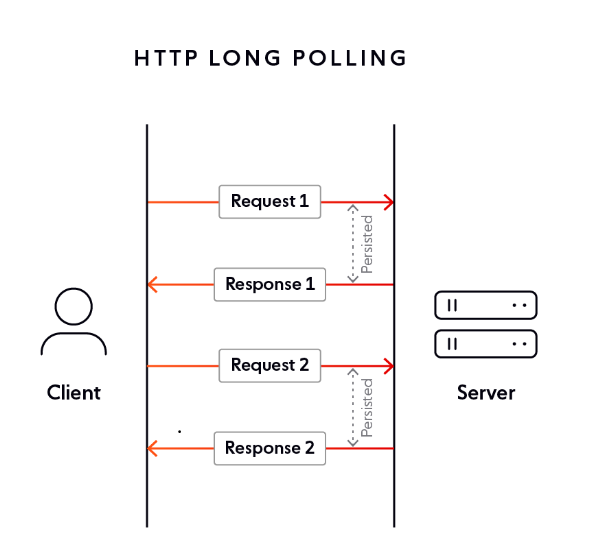

# 💬 PixelTalk  
A real-time chat application built using **Node.js**, **Express**, **Socket.IO**, and **EJS**.  
PixelTalk allows users to send and receive instant messages with live user connection updates.  


---

## 🚀 Features
- Real-time messaging using **Socket.IO**  
- User join/leave notifications  
- Simple and clean UI  
- Multiple users can chat simultaneously  
- Built with **Express** and **EJS** for server-side rendering  

---

## 🖼️ Demo
Here’s a preview of PixelTalk in action:  

  
  

---

# 🌐 Understanding WebSockets

## 🔹 HTTP vs WebSocket  
  

Traditional **HTTP** follows a *request → response → close* model. Each time the client needs information, it must open a new connection to the server.  
- This works fine for static content like loading a web page.  
- But it’s inefficient for **real-time applications** because the connection closes after every response.  

With **WebSockets**, the client sends an initial handshake request, and once the server accepts, the connection stays open.  
- The same connection can be reused for sending and receiving data.  
- The communication is **full-duplex** (both sides can talk to each other at any time).  
- This makes it perfect for chat apps, live notifications, and streaming.  

---

## 🔹 Polling  
  

**Polling** is one way developers tried to achieve “real-time” updates before WebSockets existed.  
- The client keeps sending requests at fixed intervals (e.g., every 2 seconds) asking: *“Do you have new data?”*  
- Even if there’s no update, the server still has to reply, which wastes bandwidth and CPU cycles.  

Problems with polling:  
- ⏳ Delayed updates (depends on polling interval).  
- 🖥️ High server load (lots of unnecessary requests).  
- ❌ Doesn’t scale well with many users.  

---

## 🔹 Polling vs WebSocket  
  

**WebSockets** solve the inefficiency of polling by keeping a single, persistent connection:  
- ✅ The server can **push data instantly** to the client when something changes.  
- ✅ Much **faster and more efficient** because there are no repeated requests.  
- ✅ Scales better for large applications with thousands of active connections.  

This is why WebSockets are the backbone of **chat apps, live dashboards, online games, and collaboration tools**.  

--

✨ And that’s exactly what powers **PixelTalk**: instead of asking for updates every few seconds, your chat messages flow instantly through a persistent WebSocket connection handled by **Socket.IO**.  


## 📂 Project Structure
```
CHAT_APP/
│── node_modules/
│── public/ # Static files (CSS, JS, images)
│── views/ # EJS templates
│── index.js # Main server file
│── package.json # Dependencies and scripts
│── package-lock.json
│── .gitignore
```

## 🛠️ Tech Stack

Node.js,
Express.js,
Socket.IO,
EJS (Embedded JavaScript Templates),

## 📌 How It Works

When a user connects, a socket connection is established.

Messages are broadcasted to all connected clients in real-time.

User join/leave notifications are displayed instantly.

The frontend is rendered using EJS templates with static assets from the public/ folder.

## ⚡ Installation & Setup
1. Clone the repository  
   ```bash
   git clone https://github.com/Aditya-deshmukh-1410/Pixel_Talk.git

2. Install dependencies
    npm install   

3. Start the server
   nodemon index.js

4. Open the app in your browser at:
    http://localhost:3000


## 🤝 Contribution 

Contributions are welcome!!

Fork the repository

Create a feature branch

Submit a pull request
